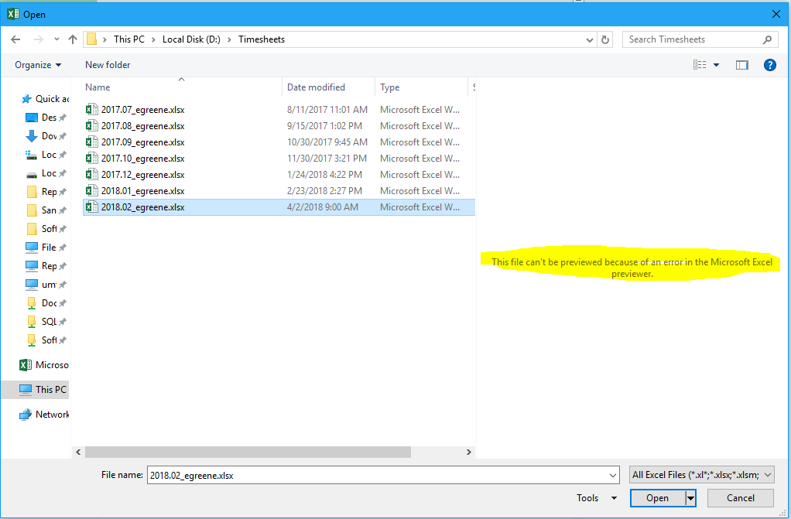

# Fix-Excel-Preview-Pane
Fixes "This file can't be previewed because of an error in the Microsoft Excel previewer." when previewing an Excel file in Excel.

This happens in the Open File Dialog in Excel.  This does nothing to fix the Preview Pane in regular Explorer.

I tried various fixes: Running a hidden scheduled task. Running excel as a service using srvstart. Script that automatically starts Excel on a new virtual window and then switches back to the original window.  This solution seems to work the best as long as your antivirus software allows you to run VBS scripts.

# What it does
1. Closes all running Excel windows.  Be sure to save anything before running the script.
2. Launches a hidden Excel window

This hidden Excel window will serve as the "Preview Handler" instance.  The previews normally don't work because the Open File Dialog blocks Excel from rendering the selected files in the Open File Dialog (herp derp Microsoft).  By having this ghost copy of Excel running, you can piggy back off its instance of Excel which doesn't have an Open File Dialog up, which means the Previews will work in all of your visible Excel instances.

# Instructions
Place the VBS file on your desktop and run it.

Alternatively, you can copy the VBS file to  %appdata%\Microsoft\Windows\Start Menu\Programs\Startup so that it runs automatically on boot up.

# The Error

